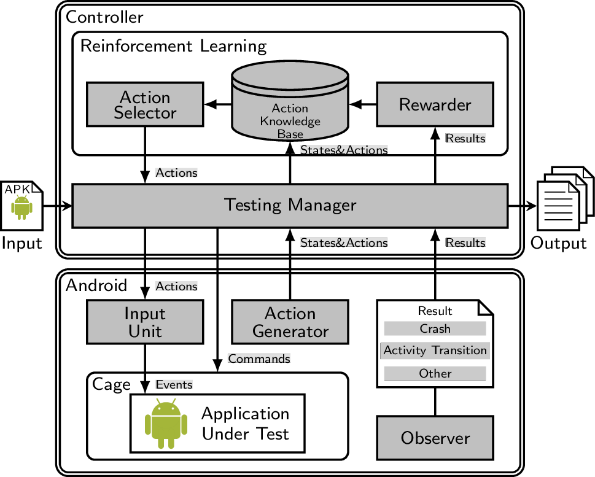

title: Home

# AimDroid: Activity-Insulated Multi-level Automated Testing for Android Applications

## Overview

## Installation

We have provided all binaries for running AimDroid on an emulator.

* [Install AimDroid on Emulator](./install-AimDroid-on-an-emulator/)

We suggest you to use AimDroid to test real commercial industrial-strength sealed apps with hundreds activities.

We have another testing framework SATA. We now working on implementing AimDroid on SATA.

* [SATA: Steering Automated Testing for Android Applications](http://gutianxiao.com/sata)

## Source

AimDroid contains the following subprojects.

1. [AimDroid-controller](https://github.com/icsnju/AimDroid-controller)
2. [AimDroid-ape](https://github.com/icsnju/AimDroid-ape)
3. [AimDroid-monitor](https://github.com/icsnju/AimDroid-monitor)

