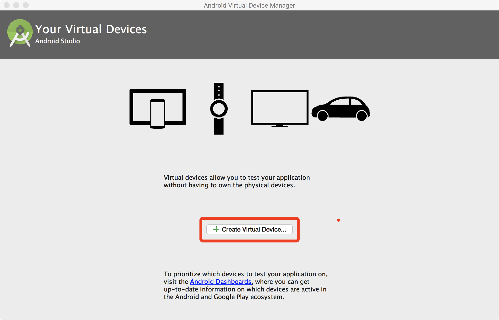
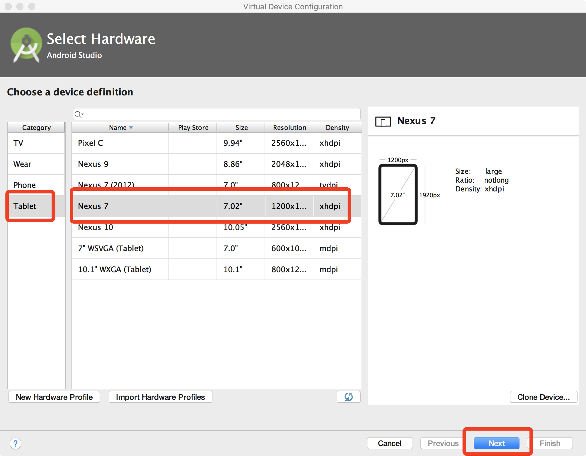
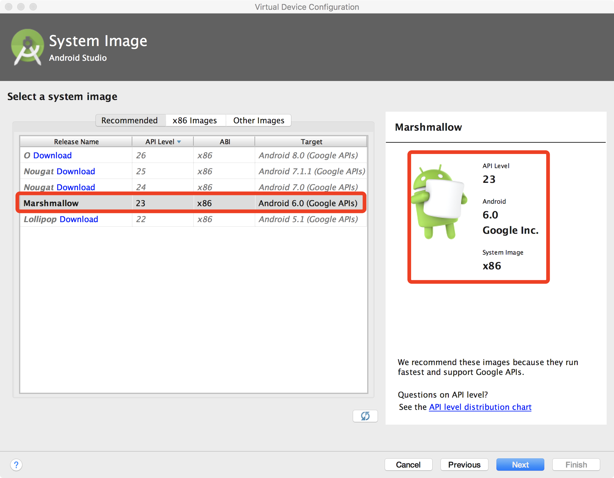
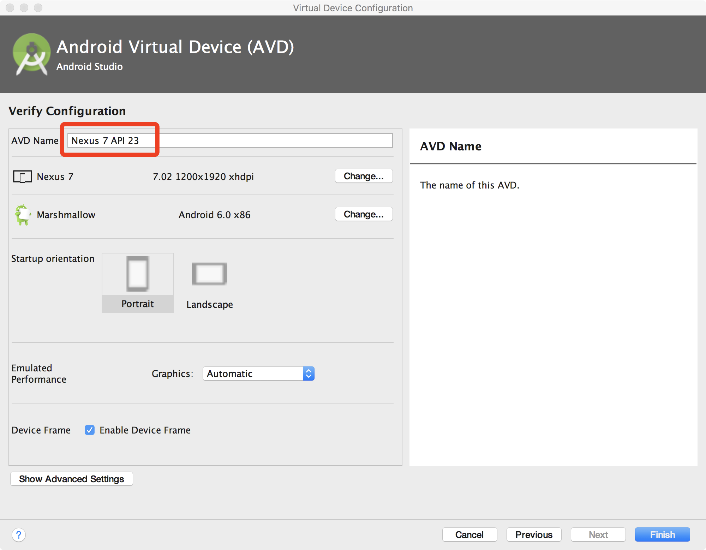

title: AimDroid on Emulator

# Install AimDroid on Emulator


The following guide is about how to setup AimDroid on an emulator and Mac OS.

There are simply six steps.

1. Create and start a Nexus 7 virtual deivce
2. Install AimDroid
3. Reboot
4. Configure the controller
5. Run


## Step 1: Create a Nexus 7 Virtual Device

1. Download and install Android Studio from <https://developer.android.com/studio/index.html>
2. Set `$ANDROID_HOME` to your SDK directory. Append `$ANDROID_HOME/build-tools/<your-actual-version>/`, `$ANDROID_HOME/platform-tools`, and `$ANDROID_HOME/emulator` to your `$PATH`

        export ANDROID_HOME=/Users/tianxiaogu/Library/Android/sdk
        export PATH=$PATH:/Users/tianxiaogu/Library/Android/sdk/build-tools/25.0.3
        export PATH=$PATH:/Users/tianxiaogu/Library/Android/sdk/platform-tools
        export PATH=$PATH:/Users/tianxiaogu/Library/Android/sdk/emulator

    !!! note:
        Remember to check the actual version of your `build-tools`. Mine is 25.0.3.

3. Open Android Studio, and then open `AVD Manager` following `Menu->Tools->Android->AVD Manager`. Create a Nexus 7 virtual device as follows.
    1. Open `AVD Manager` and click `Create Virtual Device`.

        

    2. In the new window, click tab `Tablet` and then select `Nexus 7`, and then click `next`.

        

    3. In the new window, select the recommended image (marked by red rectangle.) and then click `next`.

        

        !!! note:
            You must select the Marshmallow (Android 6.0) x86 version image.

            1. Why `Marshmallow`? Becuase the current avaiable version of AimDroid is only compatible with Android 6.0, API level 23.
            2. Why `x86`? Because first the xposed framework has no `x86_64` support (<http://dl-xda.xposed.info/framework/sdk23/>) and second arm based virtual devices are slow.

    4. Input a new name or just remember the default name and then click `Finish`.

        

    5. Finally, you can see the created virtual device.

        

4. In the command line, open the emulator from command line and enable `-writable-system`. Wait for the emulator to start up.

        emulator @Nexus_7_API_23 -writable-system

    !!! warning:
        `-writable-system` is very important because Xposed needs to modify the files under `/system`.


## Step 2: Install AimDroid.

We have downloaded all necessary binaries for installing the Xposed framework.

* [all-in-one.zip](./all-in-one.zip)

```
all-in-one
├──ape
├──ape.jar
├──app-debug.apk
├──configure.json
├──install-emulator.sh
├──monidroid
├──xposed-installer-3-1-1.apk
├──xposed-v87-sdk23-x86.zip
└──xposed-zip
    ├──META-INF
    │   ├──CERT.RSA
    │   ├──CERT.SF
    │   ├──MANIFEST.MF
    │   └──com
    │       └──google
    │           └──android
    │               ├──genymotion-ready
    │               ├──update-binary
    │               └──updater-script
    ├──flash-script.sh
    └──system
        ├──bin
        │   ├──app_process32_xposed
        │   ├──dex2oat
        │   ├──oatdump
        │   └──patchoat
        ├──framework
        │   └──XposedBridge.jar
        ├──lib
        │   ├──libart-compiler.so
        │   ├──libart-disassembler.so
        │   ├──libart.so
        │   ├──libsigchain.so
        │   └──libxposed_art.so
        └──xposed.prop

9 directories, 26 files
```

We have created a script (`install-emulator.sh`) that does the every thing but you should also know the detailed steps in case of any error.

```
./install-emulator.sh
```

### Manual Installation


1. Install Xposed.


        adb push xposed-zip /sdcard/
        adb shell "cd /sdcard/xposed && sh flash-script.sh"


2. Install the Xposed Module Manager app.

        adb install xposed-installer-3-1-1.apk

3. Install `AimDroid-ape`

        adb push ape.jar /sdcard/
        adb shell mount -o rw,remount /system
        adb push ape /system/bin/

    !!! note:
        The script can also be put into /sdcard/ on Android from 6.0. Here we put it in the `PATH` for convenient.


4. Install `AimDroid-monitor`

        adb install app-debug.apk

    !!! warning:
        Open `Xposed Installer` and enable the `MoniDroid` module.

## Step 3: Reboot

1. Reboot the virtual device to enable Xposed

        adb reboot

!!! note:
    During reboot, all apps will be recompiled by the AOT compiler of the ART again. This would take several minutes.

## Step 4: Configure the Controller

AimDroid Controller relies on a configuration file `configure.json`.
You can edit the `configure.json` in the `all-in-one` folder.

Here is a sample of configuration file.

```
{
    "PackageName":"com.google.android.apps.photos",
    "MainActivity":"com.google.android.apps.photos.home.HomeActivity",
    "SDKPath":"/Users/tianxiaogu/Library/Android/sdk/",
    "Epsilon":0.2,
    "Alpha":0.6,
    "Gamma":0.5,
    "MaxSeqLen":100,
    "MinSeqLen":20,
    "Time":3600
}
```

Here is the explanation of each option.

1. `PackageName`: the app name of the app under test.
2. `MainActivity`: the entry activity of the app.
3. `SDKPath`: the path to the Android SDK
    * We need to run the command `adb` to communicate with the phone.
4. `Epsilon`, `Alpha`, `Gamma`: the parameters for the reinforcement learning module. See the paper for more details.
5. `MaxSeqLen`, `MinSeqLen`: the length of actions in a single activity. See the paper for more details.
6. `Time`: the total testing time in seconds.

!!! note:
    Put the `configure.json` into the same directory as the controller binary `monidroid`.

## Step 5: Run

Simply invoke `monidroid` from your command line.

```
./monitroid
```
